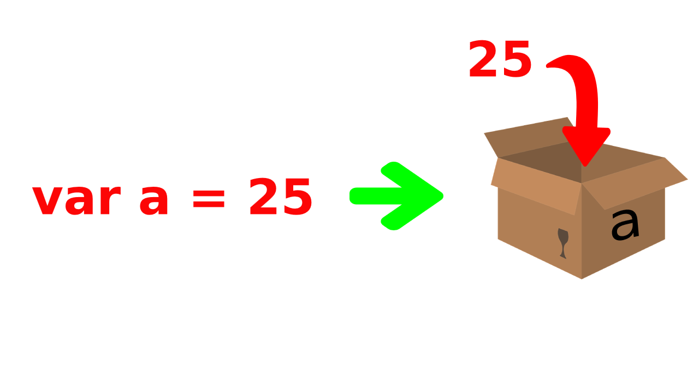
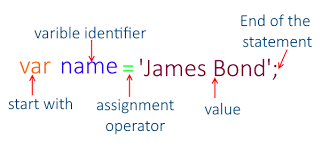

<h1 style="text-align:center;">Lesson 1 </h1>

> Assalamu alaykum JavaScript darslarimizga xush kelibsiz! Bugundan sizlar bilan JavaScriptni mukammal o’rganishni boshlaymiz!

- Dasturlash tillariga umumiy kirish.
- JavaScript tarixi.
- Nima uchun JavaScript.?
- JavaScript nima qiladi.?
- JavaScript versiyalari.
- JavaScript qayerda joylashtiriladi.?
- JavaScriptda kirish va chiqish.
- Sintaksis va izohlar.
- Identifikatorlar va nomlash qoidalari.
- JavaScriptda o'zgaruvchilar.
- JavaScriptdagi operatorlar.

    

<h1>JavaScriptga kirish</h1>

> Dasturlash tillariga umumiy kirish.!
> Dasturlash tillari kompyuter dasturlarini yaratishda ishlatiladigan asosiy vositalardir. Hozirgi kunda keng qo'llaniladigan ba'zi mashhur dasturlash tillari quyidagilar:   
> C, C++ – bu tillar tizim dasturlari, o'yinlar, va murakkab ilovalar yaratishda qo'llaniladi.!
> JavaScript, Java – JavaScript veb-ilovalar uchun, Java esa mobil ilovalar uchun keng ishlatiladi.
> Python, PHP – Python sun'iy intellekt va tahlil uchun mashhur, PHP veb-saytlarni yaratishda qo'llaniladi.!

    

<h1>JavaScript tarixi</h1>

> JavaScript 1995-yilda Brendan Eich tomonidan Netscape kompaniyasida atigi 10 kun ichida yaratilgan. Ushbu dasturlash tili dastlab Mocha deb nomlangan, keyinchalik LiveScript va nihoyat JavaScript deb nomlangan. Bu nomning tanlanishiga sabab, o'sha davrda Java dasturlash tili juda mashhur edi va Netscape bu ommaviylikdan foydalanmoqchi edi.!  
> JavaScript ikki xil versiyada mavjud bo'lib, biri Netscape Navigator, ikkinchisi esa Microsoft kompaniyasining Internet Explorer 3 brauzeriga moslashtirilgan edi. Ushbu raqobat JavaScriptning vebda keng tarqalishiga olib keldi.

    

<h1>Nima uchun JavaScript.?</h1>

> JavaScript – dinamik tiplangan dasturlash tili. Bu shuni anglatadiki, o'zgaruvchilar oldindan aniq bir tipga ega bo'lishi shart emas va ular dastur ishlashi davomida har xil tiplarga o'zgarishi mumkin. JavaScriptning yana bir qancha afzalliklari:

- <b>Brauzerda ishlash qobiliyati</b> – JavaScript asosiy veb texnologiyalaridan biri bo'lib, u mijoz tomonda ishlaydi va foydalanuvchi bilan interaktiv muhit yaratadi.

- <b>Oson o'rganish va keng qo'llanishi</b> – JavaScriptni boshlang'ich dasturchilar uchun o'rganish nisbatan oson va u internetda eng ko'p qo'llaniladigan tillardan biridir.

- <b>Yuqori moslashuvchanlik</b> – JavaScript HTML va CSS bilan birgalikda ishlatiladi va har xil veb-ilovalar yaratishda moslashuvchanlikni ta'minlaydi.!

    

<h1>JavaScript nima qiladi?</h1>

> JavaScript veb-brauzerlar uchun asosiy dasturlash tili bo'lib, u quyidagi uchta asosiy qismdan iborat:

- ECMAScript – bu JavaScriptning standartlashtirilgan asosiy qismi bo'lib, `sintaksis` va asosiy `funksiya`larni belgilaydi.   

- DOM – bu HTML va XML hujjatlarining tuzilishini boshqaradi. U foydalanuvchi harakatlarini (hodisalar: `scroll`, `keyboard`) va `formalar` bilan ishlashni boshqaradi.

- BOM – bu brauzerning o'ziga xos elementlarini, masalan, `location`, `history`, va `notifications` kabi funksiyalarni boshqaradi.

  

JavaScriptni ishlatib, siz foydalanuvchi interfeyslarini o'zgartirish, animatsiyalar yaratish, va veb sahifalarni dinamik qilish imkoniyatiga ega bo'lasiz. Masalan:

- Toggle funksiyasi – elementlarni ko'rinishini o'zgartirish.
- Navbar-shrink – skroll qilganda navigatsiya panelini kichraytirish.
- Loading – yuklanish animatsiyalari yaratish.
- Carousel – animatsiyalar va slayderlarni boshqarish.
- Dark and light mode – saytning qorong'i va yorug' rejimlarini yaratish.

    

<h1>JavaScript versiyalari</h1>

> JavaScriptning rivojlanishi davomida bir qancha versiyalari ishlabchiqilgan:

- ES5 (2009) – bu versiya ko'plab brauzerlarda to'liq qo'llab-quvvatlanadi va hozirgi kunda keng ishlatiladi.

- ES6 (2015+) – bu versiya JavaScriptda katta o'zgarishlar kiritdi, jumladan, yangi sintaksis va funksiyalar.

- Kelgusi versiyalar – har yili ECMAScriptning yangi versiyalari chiqmoqda va ular JavaScriptning yanada takomillashishiga yordam bermoqda.

    

<h1>JavaScript qayerda joylashtiriladi?</h1>

> JavaScript kodlari HTML hujjatlarida uch xil usulda joylashtirilishi mumkin:

- Inline – JavaScript kodini to'g'ridan-to'g'ri HTML teglarida yozish.
- Internal – JavaScript kodini script teglar orasida HTML hujjatning ichida yozish.
- External – JavaScript kodini alohida .js faylga yozib, HTML hujjatga ulash.

    

<h1>JavaScriptda kirish va chiqish</h1>

> JavaScriptda kirish va chiqish operatsiyalari quyidagicha amalga oshiriladi:

- Kirish: Foydalanuvchi ma'lumotlarini olish uchun `prompt` funksiyasi ishlatiladi.

- Chiqish: Ma'lumotlarni ekranga chiqarish uchun `innerHTML`, `document.write()`, `window.alert()`, `window.confirm()`, yoki `console.log()` funksiyalari ishlatiladi.!

    

<h1>Sintaksis va izohlar</h1>

> JavaScriptda kodni to'g'ri yozish uchun sintaksisga e'tibor berish kerak:

- Izohlar: Kod ichida tushuntirish yoki izohlar yozish uchun bir qatorli izohlar `//` va ko'p qatorli izohlar `/* ... */` ishlatiladi.

- Nuqtali vergul: Har bir JavaScript bayonoti (statement) oxirida ; belgisi qo'yiladi.

- Bloklar: Kodni guruhlash uchun `{}` figurali qavslar ishlatiladi.

- Ifodalar: Misol uchun, 3 + 4 bir ifoda (expression) bo'lib, natijasi 7 bo'ladi.

    

<h1>Identifikatorlar va nomlash qoidalari</h1>

> JavaScriptda o'zgaruvchi nomlarini tanlashda quyidagi qoidalarga amal qilish kerak:

- To'g'ri nomlar: Nomlar faqat harflar, raqamlar, pastki chiziq yoki dollar belgisidan iborat bo'lishi kerak.

- Raqamlar bilan boshlamaslik: O'zgaruvchi nomi raqam bilan boshlanmasligi kerak.

- Qisqa va tavsifli nomlar: Nomlar qisqa va ma'noli bo'lishi kerak.

- Kalit so'zlarni ishlatmaslik: Masalan, `var, let, const, if, else, switch, function, new, class` kabi so'zlar ishlatilmasligi kerak.

- Katta va kichik harflar: JavaScriptda nomlar katta-kichik harflarga sezgir, masalan, `a` va `A` ikki xil nom hisoblanadi.

 

## Nomlash uslublari:

PascalCase – Har bir so'zning bosh harfi katta qilib yoziladi, masalan, FirstName.

snake_case – So'zlar pastki chiziq bilan ajratiladi, masalan, first_name.

camelCase – Birinchi so'z kichik, keyingi so'zlar bosh harfi katta qilib yoziladi, masalan, firstName (tavsiya etiladi).

kebab-case – So'zlar chiziqcha bilan ajratiladi, masalan, first-name (JavaScriptda qo'llab-quvvatlanmaydi).

    

<h1>JavaScriptda o'zgaruvchilar</h1>

> O'zgaruvchilar – ma'lumotlarni saqlash uchun (kontaynerlar) bo'lib, ular JavaScript dasturlarida muhim rol o'ynaydi. O'zgaruvchilarni e'lon qilish va ularga qiymat berish quyidagi usullar bilan amalga oshiriladi:

`var` – eski usul, bir necha marta e'lon qilinishi mumkin.

`let` – ES6 bilan kiritilgan yangi usul, faqat bir marta e'lon qilinishi mumkin.

`const` – Doimiy qiymatli o'zgaruvchilar uchun ishlatiladi, ular bir marta e'lon qilinganidan keyin o'zgarmaydi.

 

  

## Muhim tushunchalar:

E'lon qilish (declaration): - O'zgaruvchini e'lon qilish, masalan, let x;

Ishga tushirish (initialization): - O'zgaruvchiga dastlabki qiymat berish, masalan, let x = 5;

O'zlashtirish (assignment): - O'zgaruvchiga yangi qiymat berish, masalan, x = 10;.

  

## var va let o'rtasidagi farqlar:

> `var` bilan e'lon qilingan o'zgaruvchilar qayta e'lon qilinishi mumkin, lekin `let` bilan e'lon qilingan o'zgaruvchilar bir marta e'lon qilinadi va keyin qayta e'lon qilinmaydi.
> Doimiylar (constants):  
> `const` bilan e'lon qilingan o'zgaruvchilar doimiy bo'lib, ularni e'lon qilish paytida qiymat berilishi kerak va bu qiymat keyin o'zgartirilmaydi.

  

## typeof operatori:

> Bu operator orqali o'zgaruvchining tipini aniqlash mumkin, masalan, typeof "Hello" natijasi string bo'ladi.

  

<h1>O'zgaruvchilarni almashtirish</h1>

> O'zgaruvchilarning qiymatlarini bir-biri bilan almashtirish quyidagi kabi amalga oshiriladi:

    let A = 10;
    let B = 20;

    let K = A;
    A = B;
    B = K;

  
    

<h1>JavaScriptdagi operatorlar</h1>

> JavaScriptda arifmetik va unar operatorlar mavjud:

| Ko'rinishi |            vazifasi            |
| :--------: | :----------------------------: |
|     +      |            qo'shish            |
|     -      |            ayirish             |
|     \*     |          ko'paytirish          |
|     /      |            bo'lish             |
|    \*\*    |        daraja ko'tarish        |
|     %      |        qoldiqli bo'lish        |
|     +x     |            musbatga            |
|     -x     |            manfiyga            |
|    ++x     |    oldindan bittaga o'sish     |
|    --x     |  oldindan bittaga kamaytirish  |
|    x++     |  orqa tomondan bittaga o'sish  |
|    x--     | orqa tomondan bittaga kamayish |
