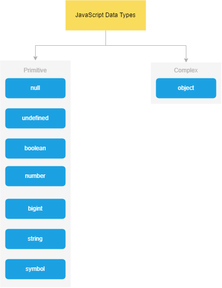
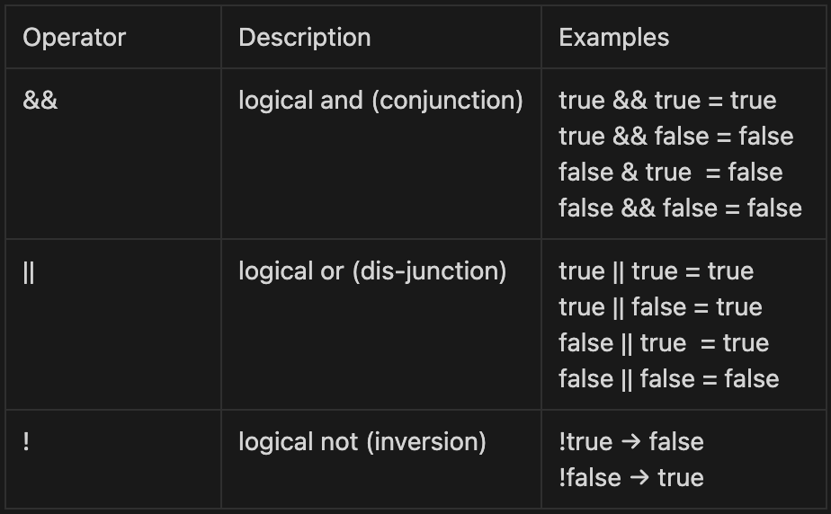

<h1 style="text-align:center;">Lesson 2 </h1>

- Data dataTypes
- Operators
- Math

 

# Data types

   

# Primitive types

## Number

      console.log(Infinity, typeof Infinity);

      console.log(12 / 0);

      console.log(NaN, typeof NaN); // Not a Number

      console.log(0 / 0);

      console.log(0b10110); // binary

      console.log(0o4762); // octal

      console.log(0xa6b8f); // hex

      console.log(0.68); // float

      console.log(0.1 + 0.2); // js bug

      console.log(12e5); // exponential

      console.log(12e-5);

      console.log(123_456_789); // numeric_separator

  

## string

      let doubleQuote = "JavaScript";

      let singleQuote = 'Programmer';

      let backTicks = `Problems`;

  

## undefined

      let firstName;

      console.log(firstName);

  

## null

      let selected = null;

      console.log(typeof selected) // javascript bug

  

## boolean

      let isMarried = false;

      let isSingle = true;

  

## bigint

      let b1 = 1231232312321312321321n;

      let b2 = BigInt(234343413213123123);

  

## symbotdel

      let s1 = Symbol();

      let s2 = Symbol();

      console.log(s1 === s2);

    

# Complex ( reference , non-primitive)

## array

      let arr = [ 1, 5, 'a', null, 'bcd', undefined ]

## object

      let person = {
       firstName: "John",
       lastName: "Doe",
       age: 21
       }

    

# Operators

## Arithmetic (mixture)

| syntax              | res |
| ------------------- | --- |
| num + str           | str |
| num - str(num)      | num |
| str(num) - str(num) | num |
| others              | NaN |

  

## Assignment

| Operator | Example   | Same As      |
| -------- | --------- | ------------ |
| =        | x = y     | x = y        |
| +=       | x += y    | x = x + y    |
| -=       | x -= y    | x = x - y    |
| \*=      | x \*= y   | x = x \* y   |
| /=       | x /= y    | x = x / y    |
| %=       | x %= y    | x = x % y    |
| \*\*=    | x \*\*= y | x = x \*\* y |

  

## Comparison

> These operators return boolean value, that is, true or false.

| Operator | Description                       |
| -------- | --------------------------------- |
| ==       | equal to                          |
| ===      | equal value and equal type        |
| !=       | not equal                         |
| !==      | not equal value or not equal type |
| >        | greater than                      |
| >=       | greater than or equal to          |
| <        | less than                         |
| <=       | less than or equal to             |

  

## Logical

> These operators help to perform operations on boolean values and return boolean value.

  

## Nullish coalescing operator

- `??`

    

# Math object

## constants, properties

    Math.E        // returns Euler's number 2.711111

    Math.PI       // returns PI

    Math.SQRT2    // returns the square root of 2

    Math.SQRT1_2  // returns the square root of 1/2

    Math.LN2      // returns the natural logarithm of 2

    Math.LN10     // returns the natural logarithm of 10

    Math.LOG2E    // returns base 2 logarithm of E

    Math.LOG10E   // returns base 10 logarithms of E

  

## Methods

| Syntax        | Task performed                           |
| ------------- | ---------------------------------------- |
| Math.round(x) | Returns x rounded to its nearest integer |
|Math.trunc(x)| Returns the integer part of x|
|Math.ceil(x)| Returns x rounded up to its nearest integer|
|Math.floor(x)| Returns x rounded down to its nearest integer||
|Math.sign(x)| Returns 1, 0, and -1 for positive, zero, and negative, respectively|
|Math.pow() |Returns the value of x to the power of y|
|Math.sqrt()| Returns the square root of x:|
|Math.abs()| Returns the absolute (positive) value of x:|
|Math.min() and Math.max()| Returns the lowest or highest value in a list of arguments|
|Math.cos(x) or Math.sin(x)| Returns the cosine and the sine|
|Math.random()| Returns a random number between 0 (inclusive), and 1 (exclusive) [0, 1)|

  

## Random

- returns a random number between 0 (inclusive), and 1 (exclusive) [0, 1)
- `Math.floor(Math.random() * (max - min) ) + min;` [min, max)
- `Math.floor(Math.random() * (max - min + 1) ) + min;` [min, max]