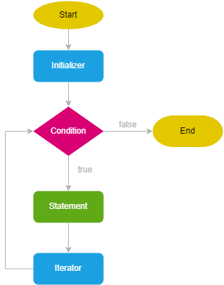
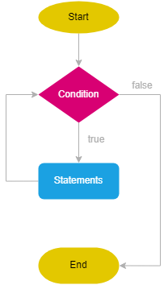
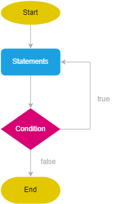
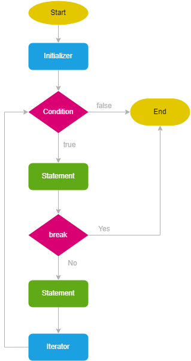
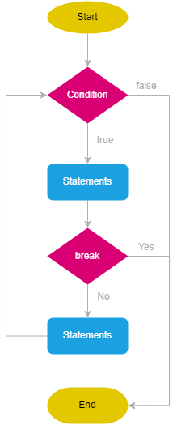
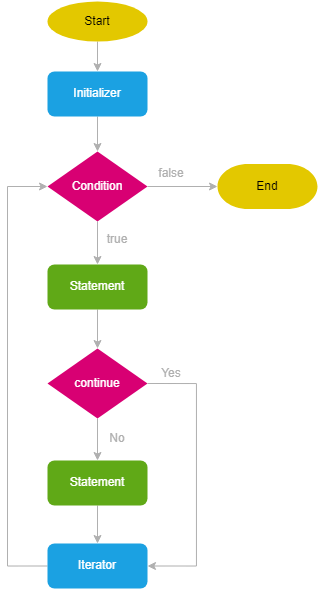

<h1>Lesson 4</h1>
 
 # Scopes
- Global scope
- Block scope
- Local or Function scope
- Module scope
- Lexical scope

# Loops
 
- for - parametrli
- while - sharti oldin tekshiriladigan
- do while - sharti keyin tekshiriladigan
 

# Break keyword

# continue keyword

     

# Scopes

 

## What is scope.?

- >The term **"scope"** refers to the accessibility and visibility of variables, functions, and objects within a particular part of a program.
-  >It determines where variables and functions can be accessed and how they interact with other parts of the code.

 

## Types 

- Global
- Block
- Local or Function
- Module
- Lexical

     

# Why loops

- Make easy of calculating.
- Help to provide DRY in web development.

    

# Loop types

- for - parametrli
- while - sharti oldin tekshiriladigan
- do while - sharti keyin tekshiriladigan

     

# for loop

- ## Syntax

      for (initializer; condition; iterator) {
          // statements
      }

      // There always must be two semicolons;

      for (let i = 1; i <= 10; i++) {
          console.log(i);
      }

      // 10 iteration - every process of loop;
      // i - iterator variable;

  

  

- ## Different cases

 `Without the initializer` 

    let j = 1; // initilizer

     for (; j <= 10; j++) {
       console.log(j);
      }

 

`Without the condition`

    for (let j = 1; ; j++) {
       console.log(j);
	   // condition
    
      if (j > 10) {
        break;
       }
    }

 

`Without the iterator`

    for (let j = 1; j < 10;) {
        console.log(j);
	    j += 1; // iterator
    }

 

`Without the initializer, condition`

    let j = 1; // initilizer

    for (;; j++) {
       console.log(j);

	  // condition
      if (j > 10) {
       break;
      }
    }

 

`Without the initializer, iterator`

     let j = 1; // initilizer

     for (; j <= 10;) {
        console.log(j); // statements
        j++; // iterator
     }  

 

`Without the condition, iterator`

    let j = 1; // initilizer

     for (;; j++) {

     // condition
      if (j > 10) {
       break;
      }

     console.log(j); // statements
    }

 

`Without any expression`

    let j = 1; // initilizer

    for (;;) {

      // condition
      if (j > 10) {
       break;
      }

      console.log(j); // statements
      j++; // iterator
    }

     

# while loop

    while (condition) {
       // code block to be executed
     }

    let count = 1;

    while (count < 10) {
        console.log(count);
        count +=2;
     }

 

    

     

# do while

     do {
        statements;
     } while (condition);

     let count = 0;

    do {
      console.log(count);
      count++;
    } while (count < 5)

 

     

# Break keyword

# for

       for (let i = 0; i < 5; i++) {
            console.log(i);
         if (i == 2) {
            break;
         }
       }

   

# while

    let i = 0;

       while (i < 5) {
         i++;
         console.log(i);
     
       if (i == 3) {
          break;
        }
     }

     

 # continue keyword

- ## for
 
      for (let i = 0; i < 10; i++) {
         if (i % 2 === 0) {
         continue;
      }
     
       console.log(i);
      }

  

- ## while

      let i = 0;
     
         while (i < 10) {
         i++;
        
         if (i % 2 === 0) {
           continue;
         }
      
        console.log(i);
      }   

